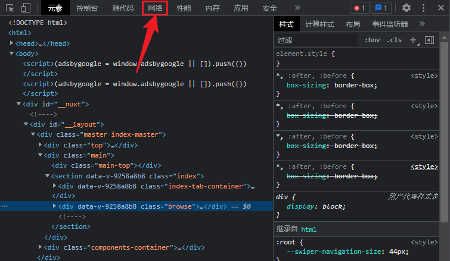
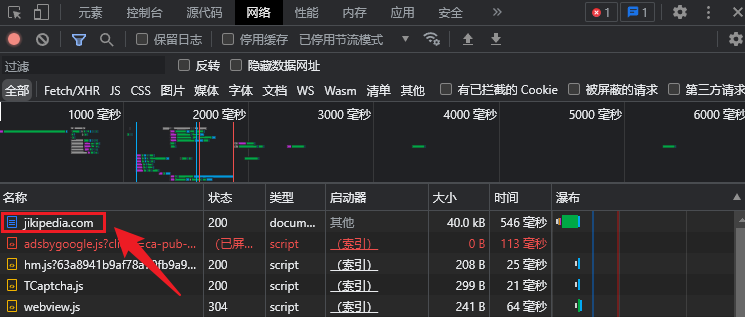
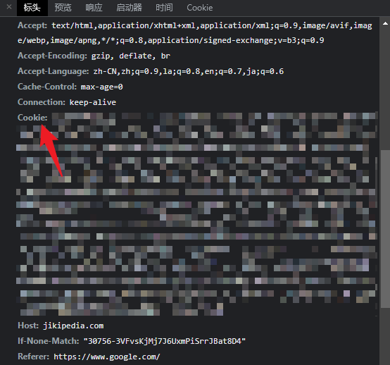

# MemeSeeker

> 基于 [Mirai Console](https://github.com/mamoe/mirai-console) 的 查梗插件

## 功能
本插件基于`小鸡词典`数据，能满足用户的查梗需求，返回关联度最高的回答

## 指令
注意: 使用前请确保可以 [在聊天环境执行指令](https://github.com/project-mirai/chat-command)  
带括号的`/`前缀是缺省的  
`<...>`中的是指令名，由`空格`隔开表示其中任一名称都可执行  
`[...]`表示参数，当`[...]`后面带`?`时表示参数可选  
`{...}`表示连续的多个参数

| 指令                           | 描述          |
|:-----------------------------|:------------|
| `(/)<meme 查梗 梗百科 梗科普> [关键词]` | 查询关键词（梗）的内容 |

## 配置
### config.yml
- `cookie` 用户登录小鸡词典的cookie（如果不设置且请求量大容易ip被禁）
- `alias` 自定义命令名称

### 获取Cookie的方法
本插件基于`小鸡词典`数据，由于该网站有反爬系统，需要获取cookie

- 首先进入 [小鸡词典官网](https://jikipedia.com)，没有账号的话注册一个账号
- 在网页中按下`F12` 或右键`检查` 会有开发者工具弹出。点击上方的`网络`一栏（英文版为`Network`）
- 此时刷新页面，在获取内容中找到`jikipedia.com`，点击进入
- 在`标头`中找到`Cookie`项，将值复制下来，填入`config.yml`

## 安装
- 从 [Releases](https://github.com/Echoosx/MemeSeeker/releases) 下载`jar`包，将其放入工作目录下`plugins`文件夹
- 如果没有`plugins`文件夹，先运行 [Mirai Console](https://github.com/mamoe/mirai-console) ，会自动生成

## TODO
- [ ] 增加被反爬限制后需要人工验证的反馈
- [ ] 使用`selenium`重构以应对反爬限制